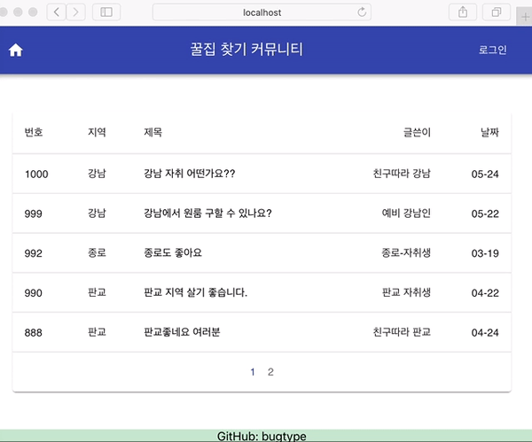
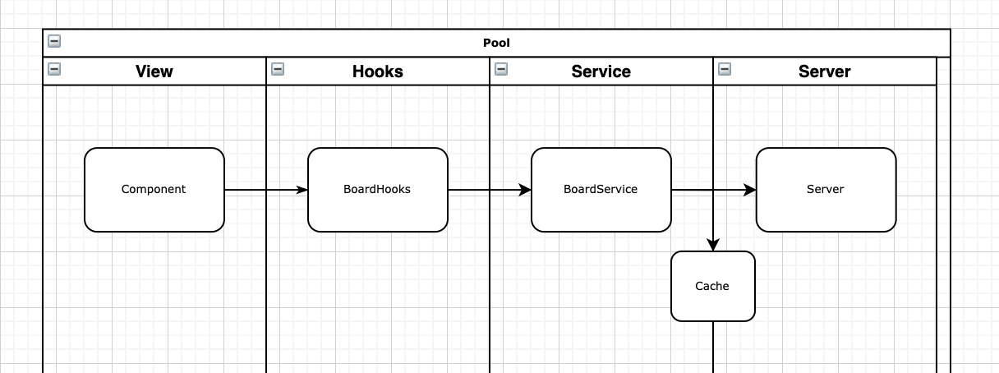

백엔드 : https://github.com/bugtype/backend-find-my-best-home

## 미리보기



## 목표

집, 자취 관련 커뮤니티 만들기

- 기능 ( R - 읽기, W - 쓰기)
  - [x] 로그인
  - [x] R 글 목록
  - [x] R 글 상세 보여주기
  - [ ] W 글 작성
  - [ ] W 댓글 기능
  - [ ] 기타
    - [ ] 조회수
    - [ ] 캐싱
- 디자인
  - UI
    - [ ] 글꼴
    - [ ] 게시글, 게시물 배치
    - [ ] 헤더, 풋터
    - [ ] 조회수 표시
  - UX
    - [ ] 현재 글 목록에서 `페이지 2` 에서 게시물 클릭시, 글 목록에서 `페이지 1` 로 보여준다.
    - [ ] 글 목록에서 `현재 게시글`이 어떤건 지 구별하지 못한다.

### 프로젝트 기술 스택

- React
- Typescript
- Rxjs
- Axios
- Eslint
- Webpack
- TODO Apollo

### 프로젝트 흐름

`View => Hooks => Service`



### 이렇게 설계한 이유는?

#### 추후 Apollo GraphQL로 변경할 것을 고려

- 추후 Apollo GraphQL로 변경하게 되면 useQuery, useMutation로 변경해야 한다. 유지보수를 고려해서 `useXXX` 으로 구현하였다.
- Service 코드를 보면 Observable로 구현 되어 있는데 GraphQL처럼 pushing을 고려했다.

#### nginx에 올리는 것을 생각해서 Docker 추가

- Frontend는 정적이다보니 CDN으로 배포해도 되지만, Nginx로 추후 라우팅처리, Cache 처리를 할 수 있기에 구현해보았다.
  
#### custom-rule 폴더는 무엇인가?

- eslint rule을 직접 커스텀하려고 일단 만들어두었다.
  - https://tech.kakao.com/2019/12/05/make-better-use-of-eslint/
- 예를 들어서 컨벤션을 정하면 강제할 수 있다.
  - `export * from './abcde'` 할 떄 순서를 sorting을 해준다던가...( eslint에는 import sorting rule 밖에 없다.... )
  - anonymous export function을 방지 ( 디버깅때 표시 안됨!!!😅 )
  
  


### 명령어

```sh

# start
npm run start

# build
npm run build

# test
npm run test

# docker run
# http://localhost:3000
npm run docker-run

```

### 개발 관련 TODO

- 이슈 트랙킹 추가
  - 자동으로 커밋에 표시되게 [PR-43] XX기능추가
- 허스키 추가
  - push 할 때, test 및 eslint code 검사하도록
- GithubAction , Jenkins 셋팅
- 추후에는 Apollo를 연결 해야한다.
- NextJs 검토
